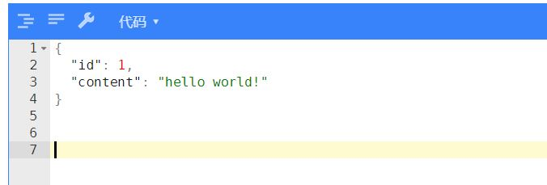
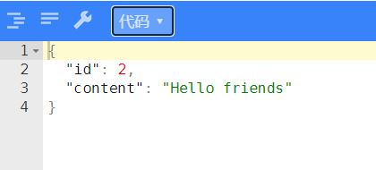

# build a restful web service whti spring boot actuator
Spring Boot Actuator是Springboot的一个子项目，
他让你能够做很少工作就把许多生产级别的服务加入到你的应用中。
在本指引中，你将会看到如何创建一个应用并添加这些服务。
## 提供一个`Hello world`API
首先创建一个API格式类：Greeting.java

`com/weilian/barwswsba/service/Greeting.java`

创建控制器:GreetingController.java

`com/weilian/barwswsba/controller/GreetingController.java`

在Spring中，Rest endpoints属于Spring MVC controller。
GreetingController.java处理`/hello-world`的`GET`请求并且返回`Greeting`资源信息。

human-facing controller和Rest endpoint controller的不同之处在于他们的返回消息输入和被创建的。
Endpoint controller直接将数据返回到HTML，而不是依赖view(像JSP)在HTML中渲染模型数据。

`@ResponseBody`注解告诉Spring MVC不要把模型渲染进视图，而是直接将返回的类写进返回信息中。
它通过使用Spring的一个消息转换器。

因为Jackson 2在classpath中，如果request的Accept head要求返回JSON格式数据，
`MappingJackson2HttpMessageConverter`会处理Greeting类到JSON的转换。

# 运行
直接在IDEA中运行BarwswsbaApplication.java，在浏览器中输入：

`http://localhost:8080/hello-world`

可以看到：

输入：
`http://localhost:8080/hello-world?name=hello friends`

可以看到：

